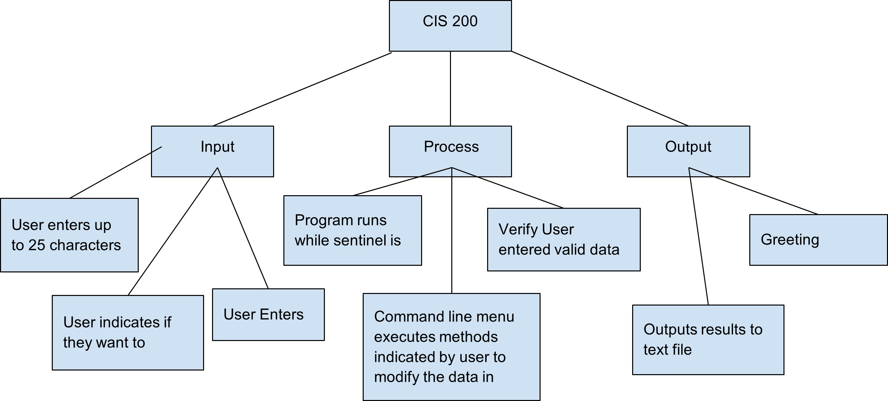

# CIS 200 Project 1 

## Problem Statment
Create a class myString that stores up 25 characters and uses methods inside the public class to update myString

## Requirements
### Assumptions
* Program will run in a sentinel loop and the program will end when the user decides to.   
* User enters the correct data type into myString  
* User enters correct length that makes sense for string  
* Take data in from a user instead of file but print out data into an output file

### Specifications
* Only methods allowed to use string variables are setString and getString
*	Main will contain a minimum of two instances of myString variables
*	Results are to be printed to output file myStringLog.txt
*	Program is to print out an error message if myString contains more than 25 characters.
*	Have a welcome statement at the beginning of the program and ask the user for the name and then thank them.
*	Constructor will initialize myString data to empty string
*	Include method status variable parameter in any method where an error can occur.
*	Have user use a command line menu to select actions to manipulate data

## Decomposition Diagram

## Test Stategy
* Invalid Data
* Valid Data
* File Testing

## Test Plan Version 1

| Test Strategy | Test Number | Description 										| Input |	Expected| Output|Actual Output 	|Pass/Fail |
| :--- 			| :---		  | :---												| :---	| :--- 		| :--- 	| :--- 		   	| :---	   |
| Valid Data	| 1	 		  |User Enters in less than 25 characters       		|       |           |       |              	|          |     
| Valid Data	| 2	 		  |Test command line menu “size”             			|       |           |       |              	|          |     
| Valid Data	| 3	 		  |Test command line menu “addEnd”             			|       |           |       |              	|          |     
| Valid Data	| 4	 		  |Test command line menu “addStart”             		|       |           |       |              	|          |     
| Invalid Data	| 5	 		  |User enters in more than 25 characters          		|       |           |       |              	|          |     
| Invalid Data	| 6	 		  |User enters incorrect data type into sentinel loop	|		|		    |		|		       	|		   |		
| File Testing	| 7	 		  |Output file is accurate with command line results	|		|			|		|		   		|		   |

## Initial Algorithm

